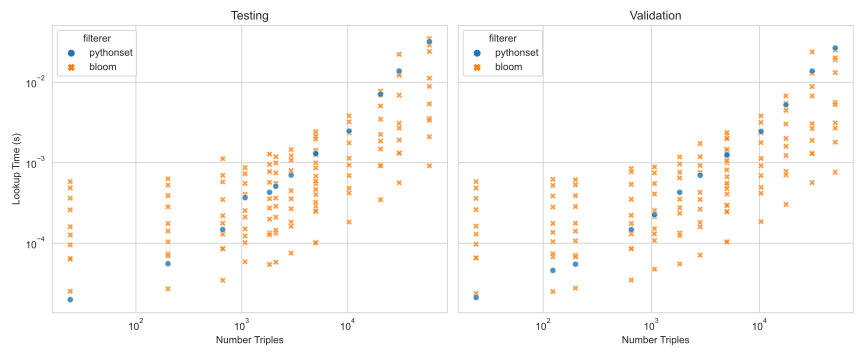

# bloom-filterer-benchmark

The bloom filterer was introduced in [PyKEEN #401](https://github.com/pykeen/pykeen/pull/401)
by Max Berrendorf ([@mberr](https://github.com/mberr)) because the exact algorithm for filtering false negative samples
during training was slow, and an approximation algorithm could do an adequate job while having huge memory and time
improvements.

The code and artifacts for this benchmarking is available on
[GitHub](https://github.com/pykeen/bloom-filterer-benchmark). It can be rerun with `python benchmark.py --force`.

## Benchmarking

Benchmarking over several datasets of varying size shows suggests that there isn't a large size-dependence on the
relationship between the bloom filter's
`error_rate` parameter and the actual error observed on either the testing or validation sets.

As expected, the time for checking the triples decreases with an increased nominal error rate.

Datasets with a larger number of triples take longer to create. The time to create a bloom filter also decreases as the
nominal error rate increases.

The size of the bloom filter increases with larger number of training triples, but also varies exponentially with the
error rate. The relationship is `log(time) ~ log(triples) + log(error rate)`.

## Comparison

The bloom filterer is compared to two exact implementations using Python sets and PyTorch (default). Several error rates
for the bloom filter are shown simultaneously, to show that there's a tradeoff that's possible for each.

The setup times show the PyTorch implementation is the fastest.

The Python-based implementation and some settings for the bloom filter outperform the PyTorch implementation.

The observed error rates were adjusted by adding `1 / number of triples` in order to make the data plottable on a log
scale, since some error rates were zero. For smaller datasets, this adjustment is relatively large, but the run times
overall are negligible. For larger datasets, this adjustment is negligible.

The following chart shows the tradeoff between the implementations (with all error rates of the bloom filter shown)
across all datasets.

