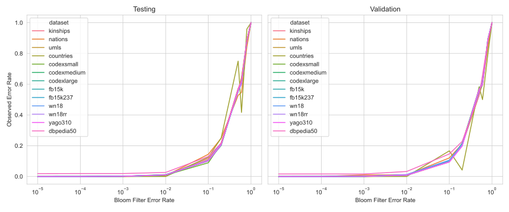
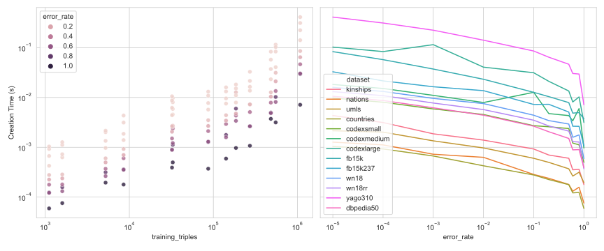
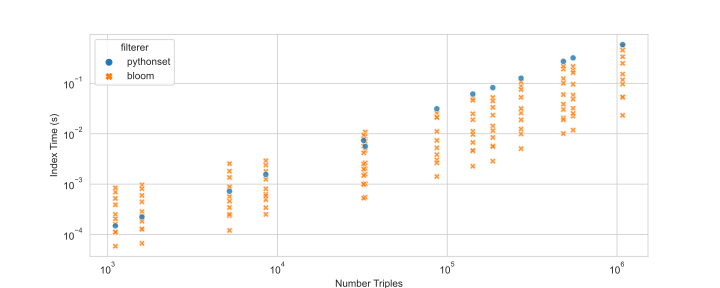

# bloom-filterer-benchmark

Negative sampling is necessary during training of knowledge graph embedding models because knowledge graphs typically
only have positive examples. Typically negative examples are derived from positive ones by corruption: replacing an 
entry of a positive triple by a random replacement. Unfortunately, this corruption technique can produce false 
negatives that are actually already in the knowledge graph. Sometimes this isn't a big deal, depending on the 
dataset, model, and learning task. PyKEEN provides the ability to filter false negatives using an exact algorithm, 
but it's quite slow.

An alternative filterer based on an approximate existence index structure called the
[bloom filter](https://en.wikipedia.org/wiki/Bloom_filter) was introduced in
[PyKEEN #401](https://github.com/pykeen/pykeen/pull/401) by Max Berrendorf ([@mberr](https://github.com/mberr)).
We then did this benchmarking study to show that it both makes a huge time improvement while maintaining a low
error rate.

The code and artifacts are available on [GitHub](https://github.com/pykeen/bloom-filterer-benchmark). 
It can be rerun with `python benchmark.py --force`.  A tutorial on how to enable the filtering of negative 
samples as well as specifics on the exact filterer and the bloom filterer are available on
[Read the Docs](https://pykeen.readthedocs.io/en/latest/reference/negative_sampling.html).

## Benchmarking

Benchmarking over several datasets of varying size shows suggests that there isn't a large size-dependence on the
relationship between the bloom filter's
`error_rate` parameter and the actual error observed on either the testing or validation sets.

As expected, the time for checking the triples decreases with an increased nominal error rate.

Datasets with a larger number of triples take longer to create. The time to create a bloom filter also decreases as the
nominal error rate increases.

The size of the bloom filter increases with larger number of training triples, but also varies exponentially with the
error rate. The relationship is `log(time) ~ log(triples) + log(error rate)`.

## Comparison

The bloom filterer is compared the exact implementation using Python sets. Several error rates
for the bloom filter are shown simultaneously, to show that there's a tradeoff that's possible for each.

The setup times show the bloom filterer is faster for larger datasets, though this only has to be done once
for any given training. The times for both implementations are sub-seconds, so they can be considered negligible.

The Python-based implementation performs well on smaller datasets, but the bloom filterer clearly wins for larger
ones. The lookup operation is repeated during training, so these times do add up.

The error rates make most sense to show on a log scale, but since the exact implementation has a constant error
rate of zero, the log scale becomes an issue. Therefore, the error rates were all adjusted by adding
`1 / number of triples`, which is the minimum possible error for any given lookup task. In this chart, you can
think of the "adjusted error rate" reported for the exact algorithm as the lower bound. Note that several datapoints
are shown for the bloom filter, which correspond to different "desired error rates" that are parameterizable
in the code.

The following chart shows the tradeoff between the implementations (with all error rates of the bloom filter shown)
across all datasets. Again, think of the adjusted error rate reported for the exact algorithm as a lower bound.

