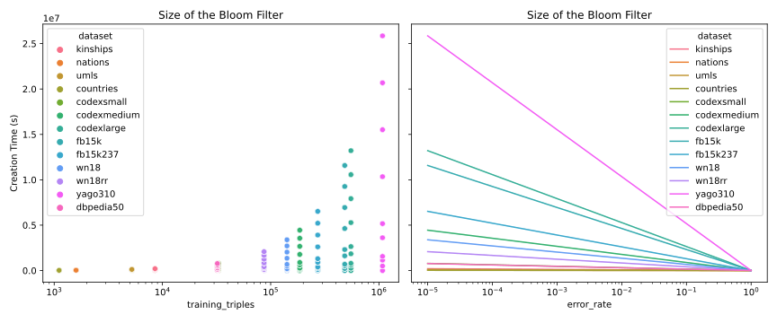

# bloom-filterer-benchmark

The bloom filterer was introduced in [PyKEEN #401](https://github.com/pykeen/pykeen/pull/401)
by Max Berrendorf ([@mberr](https://github.com/mberr)). This benchmarking can be rerun
with `python benchmark.py --force`.

Benchmarking over several datasets of varying size shows suggests that there
isn't a large size-dependence on the relationship between the bloom filter's
`error_rate` parameter and the actual error observed on either the testing
or validation sets.

As expected, the time for checking the triples decreases with an increased nominal
error rate.

Creation times

Sizes

